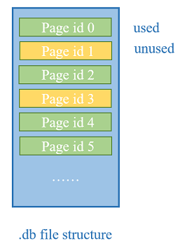

# Preface

This is a little relational database named Dawn with the basic functions implemented. So far, in the 0.1 version, every module in the DB will have a simple implementation, for example, we only implement the hash index method in the access method, and do not support the varchar type to avoid many codes not related to the DB's main functions.

The industrial DBs' codes are too complicated with many details unrelated to the main functions. So, any one wants to learn the implementation of a DB could refer to my codes and I'm happy to discuss with you.

Reference Books:
- Database System Implementation,Second Edition
- Database System Concepts, 6E

Reference Courses:
- CMU 15-445

Reference Codes:
- MariaDB
- TiDB

Email: xzhangxian@foxmail.com

# Architecture


This is the architecture of the dawn, and we will show some details in the following content.

## Disk Manager

The disk manager creates three files when the first time the DB runs.

- xxx.mtd: store some meta data about the database such as the tables' information.
- xxx.db: store DB's data
- xxx.log: store DB's log

Many blocks with 4096 Byte consist of the .db file, and each block is identified by the page id, here is the structure of the .db file. The disk manager gets the correcponding blocks with page id multiplied with 4096 and it will maintain some data structures to know which block has been used or not.

Current implementation is inefficient and we will manage the disk space with bit map and consider multiple data files to speed up the disk I/O in the later version.



## Buffer Pool Manager

The buffer pool manager's space is fixed from the beginning, but we can control it's size before the DB starts.

Evict pages with clock algorithm.

## Access Method

Instead of the OOP, we implement the access method with function pointers that can be called by the Table Object to realize the purpose of the abstraction.

Current access method only supports the hash index, B+ index will be realized in the later version.

We handle the key conflicts with link list, here is the architecture of the hash index.

link hash needs pages divided into three levels.
- first level: store the page ids of the second level's page
- second level: divided into slots which contains the page id of the page storing data
- third level: this is a double linked list and it's head page is refered by the second level page's slot


## SQL

### Support

DDL
- create table
- delete table

DML
- insert tuple
- delete tuple

DCL
- not support

DQL
- select
  - support aggregation functions
    - MAX() MIN() COUNT() SUM() AVG()
  - projection
- from
  - only support Cartesian product(×) with at most two tables
- where
  - do not support the subquery
  - support "<" "<=" ">" ">=" "=" "!="

# How to Test

```
cd Dawn
mkdir build
cd build
cmake ..
```

All the test files are in the test folder and each of them is named with _test as the end and produces the corresponding test execution file. Such as executor_test.cpp -> executor_test

```
make xxxxx_test
./test/xxxx_test
```